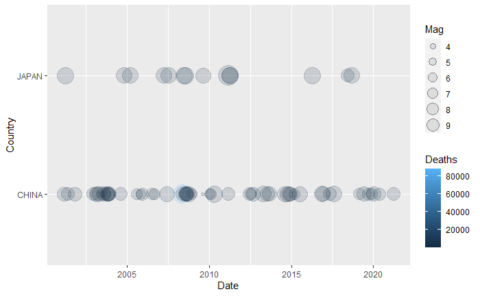
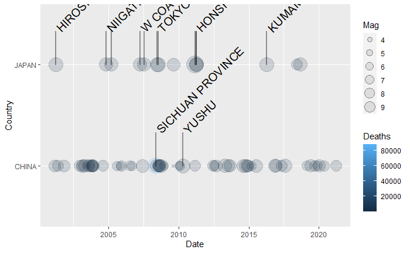
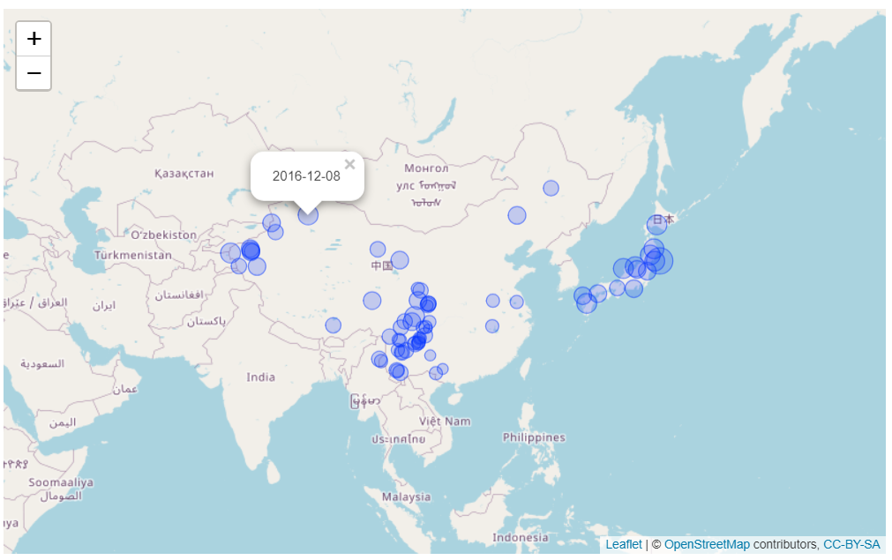

[](https://travis-ci.com/egarx/MSDProjectS)

# Mastering Software Development in R Specialization Capstone

# Tags
* Author       : Emilio Garcia
* Date         : 20/May/2021
* Course       : Mastering Software Development in R Specialization Capstone
* Project      : Capstone Project - MSDProjectS

# Loading the library
library(MSDCProjectS)

#### The Package consists of the functions:

- [eq_clean_data](R/eq_clean_data.R) -- Cleans the entire dataset to make it compatible with the other functions.
- [geom_timeline](R/geom_timeline.R) -- Displays the earthquakes as points in a plot.
- [geom_time_label](R/geom_time_label.R) -- Labels the earthquakes in the plot created by the previous function.
- [eq_map](R/eq_map.R) -- Displays the earthquakes by their location in a leaflet map.

### Loading data

path <- "..."
table_original <- read.table(file = path, sep = '\t', header = TRUE)

table <-eq_clean_data(table_original)

table_example <- dplyr::filter(table, lubridate::year(Date) > 2000,
                               Country %in% c("CHINA","JAPAN"))

table_example <- dplyr::select(table_example,Date,Country,Mag,Deaths,Location.Name)

### Plotting timeline without labelling
```r
ggplot2::ggplot(table_example) +
      geom_timeline(ggplot2::aes(x = Date, y = Country, size = Mag,color = Deaths))
```



                        
### Plotting timeline labelling
```r
ggplot2::ggplot(table_example) + geom_timeline(ggplot2::aes(x = Date,y = Country,size = Mag,color = Deaths)) +
geom_timeline_label(ggplot2::aes(x = Date, label = Location.Name,y = Country,mag = Mag,n_max = 13))
```




### Plotting map given some information
```r
table_example <- dplyr::filter(table, lubridate::year(Date) > 2000, Country %in% c("CHINA","JAPAN"))
table_example <- dplyr::select(table_example,Date,Country,Mag,Deaths,Location.Name, Longitude, Latitude)

eq_map(table_example, annot_col = "Date")
```




